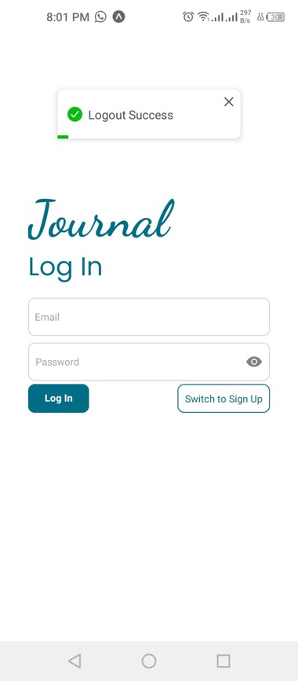
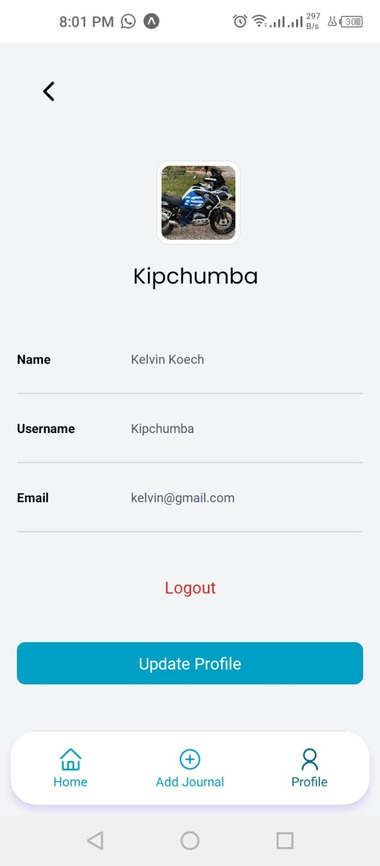

# Journal Application
#### Personal Journaling App, 10/07/2023
#### **By Kelvin Kipchumba**
## Project Description
    The goal of this project is to develop a mobile application and a backend service for personal journaling. Users should be able to create, manage, and categorize journal entries, as well as view summaries of their entries over specific periods.
    
## Setup/Installation Requirements
    - Download a file in the code section to the desired folder
    - Extract the files
    - Open the folder with vs code.

## Features
A user;
- create an account.
- Login.
- Logout.
- update his/her own profile picture, password, name and username.
- view his/her own profile after login.
- create a journal.
- fetch all journal entries belonging to them.
- edit a specific journal entry.
- delete a specific journal entry.
- get a summary of their journals within specific dates with the summary view.
- search for a journal in summary page
- Categorize his.her own journals


## Project Documentation
 - [Project Documentation](https://docs.google.com/document/d/1XNv-byj_YQxF-eKOajlqZG34ZuZikxi8rCHoAIF7NLo/edit)

### [Project demo video](https://drive.google.com/file/d/1eDeQlBxjpZ5FjrKVZeSMs634vnmTpXIE/view)

##### For Backend (Django)
###### Backend (Django REST Framework App)
- Python (3.7 or higher recommended)
- Pipenv

- Open a new terminal in VScode,  Navigate to backend folder ```cd backend```
- Run ```pipenv install``` to install its packages, then run ```pipenv shell``` to open the environment
- Run ```python manage.py runserver 0.0.0.0:8000``` in the terminal to strt your server.
- Go to your main terminal na run  ```ifconfig``` for linux OR ```ipconfig``` for windows and find your network address i.e somewhere near ``inet`` in the data that popped up i.e for me it is ``192.168.100.6``. Now copy this and add the 8000 as the port number and make a url like this i.e ```http://192.168.100.6:8000/api```
- Copy this url and navigate to the client folder- then config.json and replace the server url there to this url i.e to
    ```
    {
    "server_url": "http://192.168.100.6:8000/api"
    } 
    ```
- And the backend is ready 


##### For Frontend(Expo App)
###### Prerequisites
- Node.js and npm

- Open your terminal, ```cd client ``` and install dependencies using ```npm install```
- Then run ```npm start```
- Open your expo app in your phone and scan the QRcode taht it appeared after running npm start and you are good to go

       

## Known Bugs
    Application works perfectly well, no bugs.

## Technologies used
##### Frontend
    - Expo React Native
    - Slider
    - React 
    - Google Fonts
    - TailwindCSS

##### Backend
    - Django
    - Django Rest Framework
    - Simple JWT
    - SQLite3 for testing purposes


## Images of Expo App
##### Login and SignUp Pages 
- This is 1 screen with 2 tabs for registration and logging in of the users



##### Profile Screen
- A page to show a a logged in user information. It has a button to lout the user and also another button to open the update modal to enable the user update password, username, name or even profile picture.



##### Home Page
###### In this page a user can;
- view and delete a journal( delete button appears once you slide a journal card)
- filter journals based on categories by clicking of a specific category
- view individual journal by clicking on the card
- Click on summary of  Journals and View all journals and can filter them by dates, (daily, monthly and weekly) and also search by 
  title or content
- View his/her profile and can go to profile page by clicking on it


##### JournalDetails Screen
- A page to show a specific Journal with all its contents unlike the summarized version in Homepage. 
- It also has delete button for deletion, and update button which will direct the user to Addjournal screen for updating the journal.


##### Summary Screen
- A user can filter by dates, search by title , content and also based on daily, weekly and also Monthly 


##### Add/Update Journal Screen
- A add a journal in this screen. The screen is also reusable as it can be used on when updating the journal.


## Support and contact details
    - email :: kelvinkipchumba002@gmail.com
    - phone :: +254725801772

### License
*Licenced under the [MT-licence](https://github.com/k-koech/Journal-Shamiri/blob/master/LICENSE.md)*
Copyright (c) 2024 **Kelvin Kipchumba
